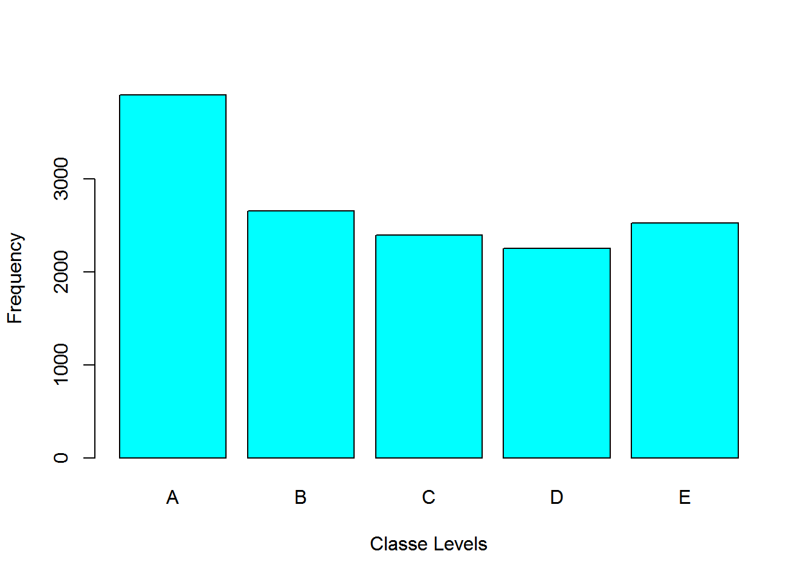
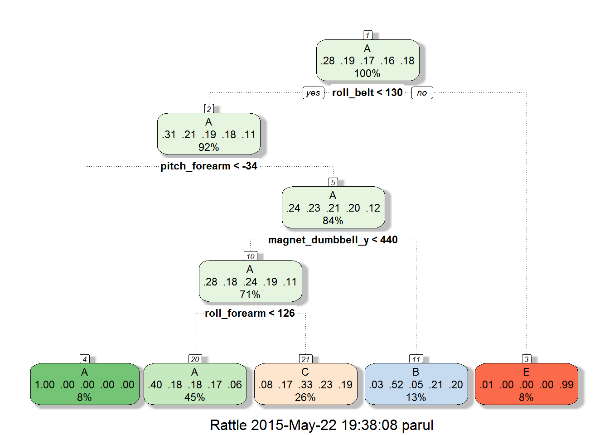
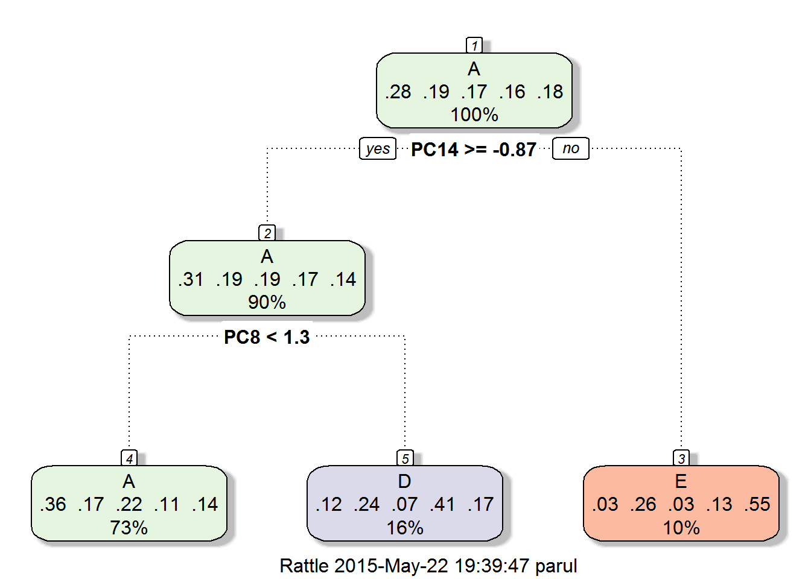

# pml-exercise
Saurabh Kumar  
Wednesday, May 20, 2015  
###Synopsis
Following report takes the personal activity data from  http://groupware.les.inf.puc-rio.br/har and fits a model to the training data to provide predictions for the testing data. Approach first cleans up the data and then fits several models to find the best one and then uses that to predict the test outcomes.

###Reading training and testing data from http://groupware.les.inf.puc-rio.br/har. Groupware has been
###very genrous in providing the data to be used for this assignment.

```r
   # URL_training <- "http://d396qusza40orc.cloudfront.net/predmachlearn/pml-training.csv"
  #  URL_testing <- "http://d396qusza40orc.cloudfront.net/predmachlearn/pml-testing.csv"
   # download.file(URL_training,destfile="pml-training.csv", mode="wb")
    #download.file(URL_testing,destfile="pml-testing.csv", mode="wb")
    training <- read.csv("pml-training.csv",na.strings = c("NA", ""))
    testing <- read.csv("pml-testing.csv",na.strings = c("NA", ""))
    dim(training)
```

```
## [1] 19622   160
```

```r
    dim(testing)
```

```
## [1]  20 160
```
###Data Cleanup : Some variables are irrelevant, removing them from the dataset
Remove following columns
*columns X, User_name, cvtd_timestamp, raw_timestamp_part_2, new_window, num_window
*columns with nzv as TRUE
*columns with 95% NAs

```r
library(caret)
```

```
## Loading required package: lattice
## Loading required package: ggplot2
```

```r
training <- training[,-c(1:7)] 
testing <- testing[,-c(1:7,160)]
nsv <- data.frame(nearZeroVar(training, saveMetrics=TRUE))
cnm <- rownames(nsv[!nsv$nzv,])
training <- training[, cnm]
testing <- testing[, cnm[1:length(cnm)-1]]
training <- training[, colSums(is.na(training)) < 0.95 * nrow(training)]
testing <- testing[,c(names(training[,-ncol(training)]))]
```
###Partition the training test data set to allow cross validation. Partition will be at 70% and 30%

```r
subTrain <- createDataPartition(y=training$classe,p=0.70,list=FALSE)
subTraining <- training[subTrain,]
subTest <- training[-subTrain,]
```
###Plot the output data in subTraining

```r
plot(subTraining$classe, col="cyan", xlab="Classe Levels", ylab="Frequency")
```

 
We do not see a lot of skewness which is good. Level A is most common.  

###Fit classification tree and random forest models one by one and check with subTraining data and test them with subTesting data.

### model 1 : classification tree without preprocessing

```r
library(rattle)
```

```
## Rattle: A free graphical interface for data mining with R.
## Version 3.4.1 Copyright (c) 2006-2014 Togaware Pty Ltd.
## Type 'rattle()' to shake, rattle, and roll your data.
```

```r
library(rpart)
set.seed(12345)
model1 <- train(classe ~ ., method="rpart", data=subTraining)
prediction1 <- predict(model1, subTest)
fancyRpartPlot(model1$finalModel)
```

 
### model 1 : Check accuracy on subTest data

```r
confusionMatrix(prediction1,subTest$classe)
```

```
## Confusion Matrix and Statistics
## 
##           Reference
## Prediction    A    B    C    D    E
##          A 1521  493  479  421  155
##          B   31  374   28  189  139
##          C  118  272  519  354  302
##          D    0    0    0    0    0
##          E    4    0    0    0  486
## 
## Overall Statistics
##                                           
##                Accuracy : 0.4928          
##                  95% CI : (0.4799, 0.5056)
##     No Information Rate : 0.2845          
##     P-Value [Acc > NIR] : < 2.2e-16       
##                                           
##                   Kappa : 0.3369          
##  Mcnemar's Test P-Value : NA              
## 
## Statistics by Class:
## 
##                      Class: A Class: B Class: C Class: D Class: E
## Sensitivity            0.9086  0.32836  0.50585   0.0000  0.44917
## Specificity            0.6324  0.91846  0.78473   1.0000  0.99917
## Pos Pred Value         0.4956  0.49146  0.33163      NaN  0.99184
## Neg Pred Value         0.9457  0.85070  0.88264   0.8362  0.88953
## Prevalence             0.2845  0.19354  0.17434   0.1638  0.18386
## Detection Rate         0.2585  0.06355  0.08819   0.0000  0.08258
## Detection Prevalence   0.5215  0.12931  0.26593   0.0000  0.08326
## Balanced Accuracy      0.7705  0.62341  0.64529   0.5000  0.72417
```

### model 2 : classification tree with preprocessing

```r
model2 <- train(classe ~ ., method="rpart",preProcess="pca", data=subTraining)
prediction2 <- predict(model2, subTest)
fancyRpartPlot(model2$finalModel)
```

 
### model 2 : Check accuracy on subTest data

```r
confusionMatrix(prediction2,subTest$classe)
```

```
## Confusion Matrix and Statistics
## 
##           Reference
## Prediction    A    B    C    D    E
##          A 1530  754  947  490  591
##          B    0    0    0    0    0
##          C    0    0    0    0    0
##          D  122  239   59  379  159
##          E   22  146   20   95  332
## 
## Overall Statistics
##                                           
##                Accuracy : 0.3808          
##                  95% CI : (0.3684, 0.3933)
##     No Information Rate : 0.2845          
##     P-Value [Acc > NIR] : < 2.2e-16       
##                                           
##                   Kappa : 0.1696          
##  Mcnemar's Test P-Value : NA              
## 
## Statistics by Class:
## 
##                      Class: A Class: B Class: C Class: D Class: E
## Sensitivity            0.9140   0.0000   0.0000   0.3932  0.30684
## Specificity            0.3393   1.0000   1.0000   0.8823  0.94108
## Pos Pred Value         0.3548      NaN      NaN   0.3956  0.53984
## Neg Pred Value         0.9085   0.8065   0.8257   0.8813  0.85769
## Prevalence             0.2845   0.1935   0.1743   0.1638  0.18386
## Detection Rate         0.2600   0.0000   0.0000   0.0644  0.05641
## Detection Prevalence   0.7327   0.0000   0.0000   0.1628  0.10450
## Balanced Accuracy      0.6267   0.5000   0.5000   0.6377  0.62396
```

### model 3 : Random Forest without preprocessing

```r
library(randomForest)
```

```
## randomForest 4.6-10
## Type rfNews() to see new features/changes/bug fixes.
```

```r
model3 <- randomForest(subTraining[,-c(ncol(subTraining))], subTraining$classe)
prediction3 <- predict(model3, subTest)
#fancyRpartPlot(model3$finalModel)
```
### model 3 : Check accuracy on subTest data

```r
confusionMatrix(prediction3,subTest$classe)
```

```
## Confusion Matrix and Statistics
## 
##           Reference
## Prediction    A    B    C    D    E
##          A 1674   11    0    0    0
##          B    0 1126    2    0    0
##          C    0    2 1023   13    2
##          D    0    0    1  950    0
##          E    0    0    0    1 1080
## 
## Overall Statistics
##                                           
##                Accuracy : 0.9946          
##                  95% CI : (0.9923, 0.9963)
##     No Information Rate : 0.2845          
##     P-Value [Acc > NIR] : < 2.2e-16       
##                                           
##                   Kappa : 0.9931          
##  Mcnemar's Test P-Value : NA              
## 
## Statistics by Class:
## 
##                      Class: A Class: B Class: C Class: D Class: E
## Sensitivity            1.0000   0.9886   0.9971   0.9855   0.9982
## Specificity            0.9974   0.9996   0.9965   0.9998   0.9998
## Pos Pred Value         0.9935   0.9982   0.9837   0.9989   0.9991
## Neg Pred Value         1.0000   0.9973   0.9994   0.9972   0.9996
## Prevalence             0.2845   0.1935   0.1743   0.1638   0.1839
## Detection Rate         0.2845   0.1913   0.1738   0.1614   0.1835
## Detection Prevalence   0.2863   0.1917   0.1767   0.1616   0.1837
## Balanced Accuracy      0.9987   0.9941   0.9968   0.9926   0.9990
```


### model 4 : Random Forest with preprocessing

```r
model4 <- randomForest(subTraining[,-c(ncol(subTraining))], subTraining$classe,preProcess="pca")
prediction4 <- predict(model4, subTest)
#fancyRpartPlot(model3$finalModel)
```
### model 4 : Check accuracy on subTest data

```r
confusionMatrix(prediction4,subTest$classe)
```

```
## Confusion Matrix and Statistics
## 
##           Reference
## Prediction    A    B    C    D    E
##          A 1674    9    0    0    0
##          B    0 1128    3    0    0
##          C    0    2 1022   13    2
##          D    0    0    1  950    0
##          E    0    0    0    1 1080
## 
## Overall Statistics
##                                           
##                Accuracy : 0.9947          
##                  95% CI : (0.9925, 0.9964)
##     No Information Rate : 0.2845          
##     P-Value [Acc > NIR] : < 2.2e-16       
##                                           
##                   Kappa : 0.9933          
##  Mcnemar's Test P-Value : NA              
## 
## Statistics by Class:
## 
##                      Class: A Class: B Class: C Class: D Class: E
## Sensitivity            1.0000   0.9903   0.9961   0.9855   0.9982
## Specificity            0.9979   0.9994   0.9965   0.9998   0.9998
## Pos Pred Value         0.9947   0.9973   0.9836   0.9989   0.9991
## Neg Pred Value         1.0000   0.9977   0.9992   0.9972   0.9996
## Prevalence             0.2845   0.1935   0.1743   0.1638   0.1839
## Detection Rate         0.2845   0.1917   0.1737   0.1614   0.1835
## Detection Prevalence   0.2860   0.1922   0.1766   0.1616   0.1837
## Balanced Accuracy      0.9989   0.9949   0.9963   0.9926   0.9990
```

###Model Selection and execution against testing data
Model 4, Random Forest with preporcessing using PCA is the most accurate.
Running model 4 against the test data

```r
prediction <- predict(model4,newdata=testing)
```

### Generating files for submission.

```r
pml_write_files = function(x){
  n = length(x)
  for(i in 1:n){
    filename = paste0("problem_id_",i,".txt")
    write.table(x[i],file=filename,quote=FALSE,row.names=FALSE,col.names=FALSE)
  }
}
pml_write_files(prediction)
```
